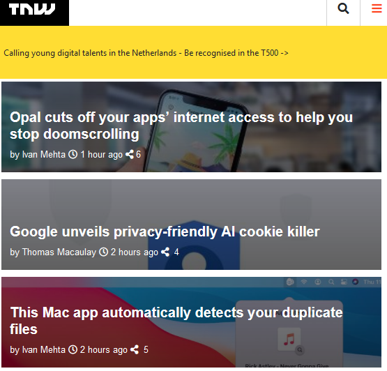
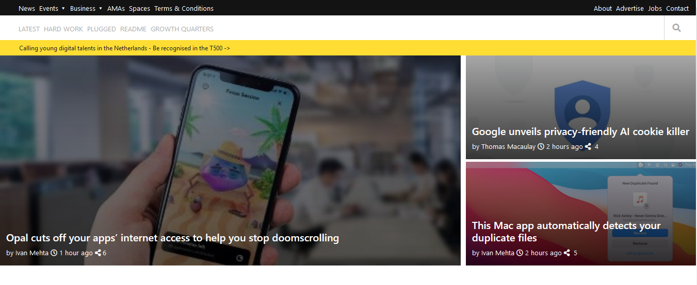
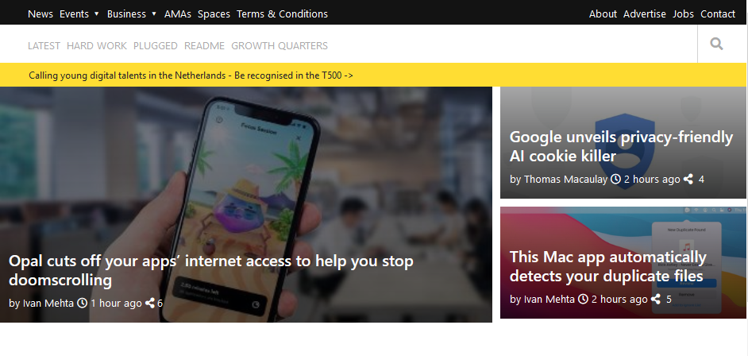

# Responsive Web Design

The goal of this project is to build a web page that resembles a [TNW article](https://perma.cc/M5ZV-Q2D6) using positioning tools like `flex`, `grid `and `float`. 

The project has a nav-bar with its icons (No javascript was used in the project), it also has embedded images and video to go along the pararaphs and different kinds of fonts used in it.

## Built With

- HTML
- CSS
- Technologies used such as: Linters (Lighthouse, Webhint, Stylelint), Extensions (Live server, Prettier), Git, among others.

## Live Demo

[Live Demo Link](https://mariordgez.github.io/Responsive_Design_Habeeb_Mario/)

## Authors

👤 **Mario Alberto Rodriguez Cota**

- GitHub: [@mariordgez](https://github.com/mariordgez)
- Twitter: [@MarioRo75396624](https://twitter.com/MarioRo75396624)
- LinkedIn: [LinkedIn](www.linkedin.com/in/mario-alberto-rodriguez-cota-a2860a205)

👤 **Habeeb Edun**
- GitHub: [@edungit](https://github.com/edungit)
- Twitter: [Edunaty1](https://twitter.com/Edunaty1)
- LinkedIn: [LinkedIn](https://www.linkedin.com/in/edun-habeeb-635680131/)

## 🤝 Contributing

Contributions, issues, and feature requests are welcome!

Feel free to check the [issues page](https://github.com/mariordgez/Responsive_Design_Habeeb_Mario/issues).

## Show your support

Give a ⭐️ if you like this project!

## 📝 License

This project is [MIT](./MIT.md) licensed.

